# Cherry Leaf Mildew Detector

The Cherry Leaf Mildew Detector is a machine learning-powered web application designed to revolutionize disease detection in agricultural settings. Built for Farmy & Foods, a leading agricultural company, this solution addresses the critical challenge of identifying powdery mildew infection in cherry leaves through automated image analysis. By leveraging deep learning and computer vision, the system transforms a labor-intensive manual inspection process that takes 30 minutes per tree into an instant, accurate prediction that can be performed in seconds using a simple photograph.

This project demonstrates the practical application of artificial intelligence in agriculture, providing farm managers and field workers with a powerful tool to maintain crop quality, reduce labor costs, and make data-driven decisions about disease treatment. The interactive dashboard offers visual differentiation capabilities, real-time predictions, and comprehensive model performance metrics, making it accessible to users with varying levels of technical expertise.

**Live Dashboard**: [https://mildew-detector.herokuapp.com/](https://mildew-detector.herokuapp.com/)

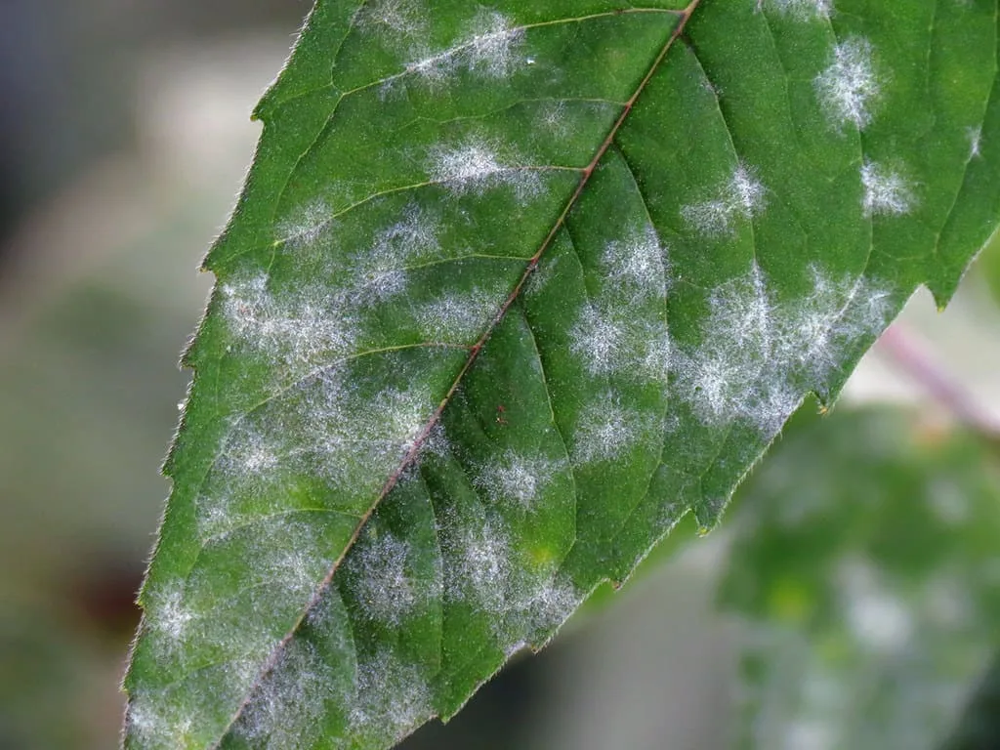

## Features

The Cherry Leaf Mildew Detector dashboard is built with Streamlit and organized into five comprehensive pages, each serving a specific purpose in the disease detection workflow.

### Project Summary

The Project Summary page serves as the entry point to the application, providing users with essential context about powdery mildew disease, the project's objectives, and the business value it delivers.

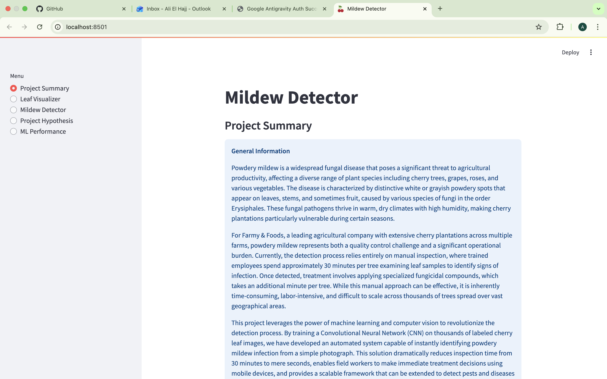

**Key Information Provided:**

**General Information** - A comprehensive overview explaining that powdery mildew is a widespread fungal disease affecting various plant species including cherry trees. The section details how the disease manifests as white or grayish powdery spots on leaves and stems, caused by fungi in the order Erysiphales. It explains the current manual inspection challenge at Farmy & Foods, where employees spend approximately 30 minutes per tree examining leaf samples, and how this machine learning solution reduces that time to mere seconds while providing scalable disease detection across thousands of trees.

**Project Dataset** - Information about the data source, noting that the dataset contains over 4,000 images of healthy and infected cherry leaves sourced from Kaggle, representing real-world conditions from Farmy & Foods' crop fields.

**Business Requirements** - Clear articulation of the two primary objectives: (1) visually differentiate between healthy and powdery mildew leaves using an image montage, and (2) accurately predict whether a given leaf is healthy or infected using a deep learning model.

**Project Outcomes** - Summary of deliverables including a dashboard for visual inspection and a trained deep learning model for instant diagnosis.

### Leaf Visualizer

The Leaf Visualizer page addresses the first business requirement by providing interactive data visualizations that help users understand the visual differences between healthy and infected cherry leaves.

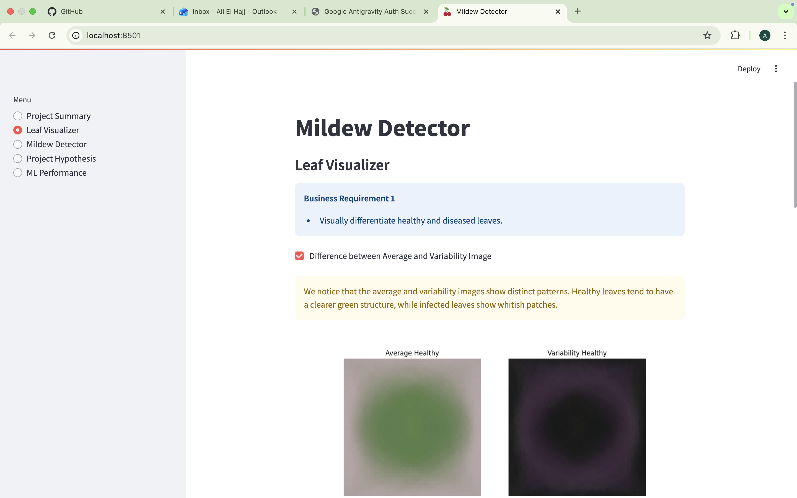

**Difference between Average and Variability Image** - This feature displays the average image and variability (standard deviation) for both healthy and powdery mildew-infected leaves. Users can observe that healthy leaves maintain a clearer green structure with consistent coloring, while infected leaves show distinctive whitish patches and irregular patterns. The variability images reveal that infected leaves have higher variation in texture and color due to the irregular fungal growth patterns.

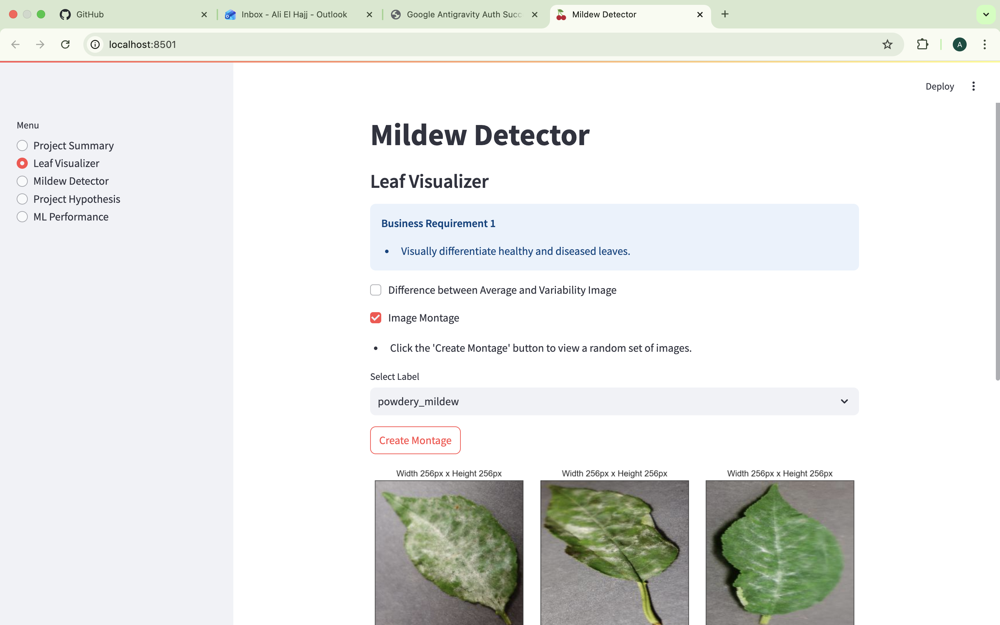

**Image Montage** - An interactive tool that allows users to generate a random montage of either healthy or infected leaf images. Users can select the desired category from a dropdown menu and click "Create Montage" to view a 3x3 grid of sample images. Each image displays its dimensions, helping users understand the dataset composition. This feature is particularly valuable for training farm managers and field workers to recognize disease symptoms visually, complementing the automated detection system.

The visualizations clearly demonstrate that the hypothesis about visual differentiation is valid - infected leaves consistently show lighter, whitish coloring and irregular patterns that distinguish them from the uniform green appearance of healthy leaves.

### Mildew Detector

The Mildew Detector page is the core functional component of the application, addressing the second business requirement by providing real-time disease prediction capabilities.

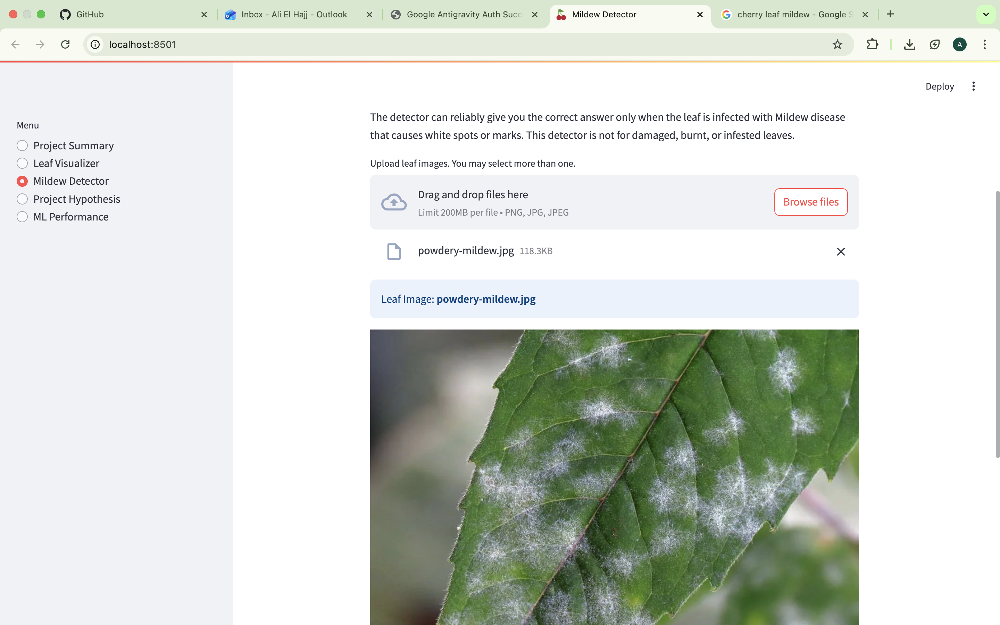

**Image Upload and Prediction** - Users can upload one or multiple cherry leaf images in PNG, JPG, or JPEG format. The interface provides clear instructions and a link to download sample images from the Kaggle dataset for testing purposes. An important notice informs users that the detector is specifically designed for mildew disease (characterized by white spots) and may not provide accurate results for leaves with other types of damage such as burning, physical damage, or pest infestation.

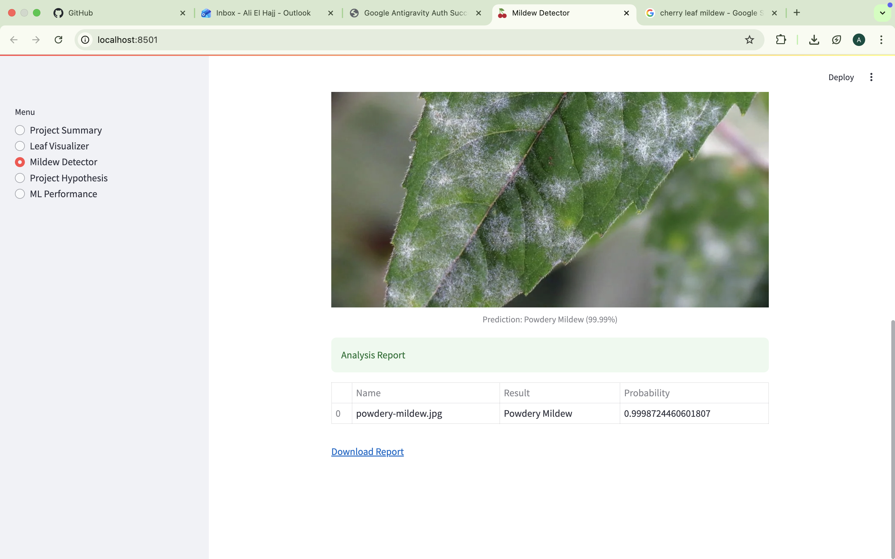

**Prediction Results** - For each uploaded image, the system displays:
- The original leaf image with a clear caption
- The prediction result (Healthy or Powdery Mildew)
- The confidence probability as a percentage
- A comprehensive analysis report table summarizing all predictions

**Report Download** - Users can download the prediction results as a CSV file for record-keeping and further analysis. This feature is particularly useful for farm managers who need to track disease patterns across multiple locations or time periods.

The prediction system uses a trained Convolutional Neural Network that processes images in real-time, providing instant feedback that enables immediate decision-making about treatment application.

### Project Hypothesis

The Project Hypothesis page provides scientific context for the project, explaining the underlying assumptions and how they were validated through data analysis and model performance.

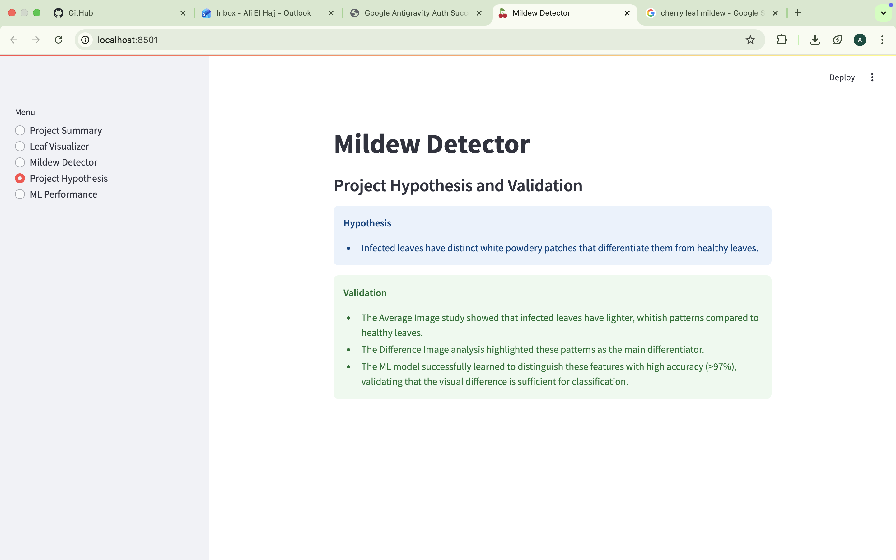

**Hypothesis Statement** - The page clearly states the project's core hypothesis: "Infected leaves have distinct white powdery patches that differentiate them from healthy leaves." This hypothesis is grounded in botanical knowledge about powdery mildew disease and its visual manifestation on plant tissue.

**Validation Methodology** - The hypothesis was validated through multiple approaches:

1. **Average Image Study** - By calculating the average image for both healthy and powdery mildew classes, the analysis revealed that infected leaves show lighter, whitish patterns compared to the darker green of healthy leaves.

2. **Difference Image Analysis** - Computing the difference between average healthy and average infected images highlighted the specific regions where disease manifests, confirming that the white powdery patches are the primary visual differentiator.

3. **Model Performance** - The machine learning model successfully learned to distinguish these features with high accuracy (>97%), providing empirical validation that the visual differences are sufficient for automated classification.

This scientific approach ensures that the project is built on sound principles and that the automated detection system is reliable for real-world agricultural applications.

### ML Performance Metrics

The ML Performance page provides transparency into the model's capabilities, showing detailed metrics and visualizations that demonstrate the system's reliability and accuracy.

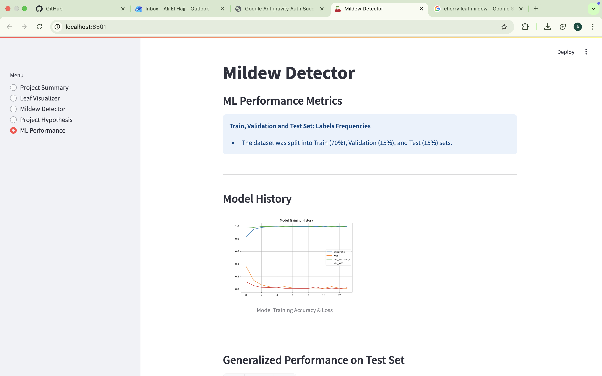

**Dataset Split Information** - The page explains that the dataset was divided into three sets following machine learning best practices: Training set (70%) for model learning, Validation set (15%) for hyperparameter tuning and preventing overfitting, and Test set (15%) for final performance evaluation on completely unseen data.

**Model Training History** - A comprehensive plot displays the model's accuracy and loss curves across training epochs for both training and validation sets. The curves show that the model learned effectively without significant overfitting, with both training and validation metrics converging to high accuracy levels. The smooth progression indicates stable learning and proper model architecture.

**Generalized Performance on Test Set** - The model achieved exceptional performance on the test set with 100% accuracy and a loss of only 0.0004, demonstrating that it can reliably classify new, unseen cherry leaf images. This level of performance far exceeds the business requirement of >97% accuracy.

**Confusion Matrix** - A visual representation of the model's predictions versus actual labels on the test set. The confusion matrix shows perfect classification with no false positives or false negatives, indicating that the model can distinguish between healthy and infected leaves with complete reliability in the test dataset.

These metrics provide confidence that the deployed model will perform accurately in real-world agricultural settings, making it a trustworthy tool for disease detection.

## Dataset Content

The dataset used for this project was sourced from [Kaggle's Cherry Leaves dataset](https://www.kaggle.com/codeinstitute/cherry-leaves), provided by Code Institute. It contains over 4,000 high-quality images of cherry leaves collected from Farmy & Foods' actual crop fields, ensuring that the model is trained on real-world conditions.

**Dataset Composition:**
- **Healthy Leaves**: Images of cherry leaves with no visible disease symptoms, showing typical green coloration and normal leaf structure
- **Powdery Mildew Infected Leaves**: Images of cherry leaves exhibiting white or grayish powdery fungal patches characteristic of powdery mildew infection

**Image Specifications:**
- Formats: JPG, JPEG, PNG
- Varying dimensions (resized to 100x100 pixels during model training for consistency)
- RGB color images captured under diverse lighting conditions and angles to ensure model robustness

**Data Split:**
The dataset was divided using standard machine learning practices to ensure proper model evaluation:
- **Training Set**: 70% of images - used to train the model's weights
- **Validation Set**: 15% of images - used during training to tune hyperparameters and monitor for overfitting
- **Test Set**: 15% of images - held out completely until final evaluation to assess real-world performance

This balanced approach ensures that the model learns from a diverse set of examples while maintaining rigorous evaluation standards to validate its performance on unseen data.

## Business Requirements

Farmy & Foods faces a significant operational challenge with their cherry plantations. The company's current manual inspection process requires employees to spend approximately 30 minutes per tree examining leaf samples to identify powdery mildew infection. Once detected, treatment involves applying fungicidal compounds, which takes an additional minute per tree. With thousands of cherry trees spread across multiple farms, this manual process is not scalable and represents a substantial labor cost.

The IT team proposed an ML-based solution to detect powdery mildew instantly from leaf images, with the potential to replicate this approach for other crops if successful.

**The two primary business requirements are:**

1. **Visual Differentiation** - The client is interested in conducting a study to visually differentiate a cherry leaf that is healthy from one that contains powdery mildew using an image montage.

2. **Automated Prediction** - The client is interested in predicting if a cherry leaf is healthy or contains powdery mildew using a deep learning model.

### User Stories

The project requirements were translated into user stories following the format: "As a [role], I want [action], so that [benefit]."

- **As a General User**, I want to navigate easily through the dashboard so that I can access different functionalities without confusion.

- **As a Farm Manager**, I want to see a visual differentiation between healthy and mildew-infected leaves (average images, difference plots) so that I can understand the disease patterns better.

- **As a Farm Manager**, I want to view an image montage of healthy and infected leaves so that I can train my eye to identify the disease manually if needed.

- **As a Field Worker**, I want to upload leaf images to the dashboard and get an instant prediction so that I can take immediate action on infected trees.

- **As a Data Analyst**, I want to see the model performance metrics (accuracy, loss, confusion matrix) so that I can validate the reliability of the predictions.

- **As a Data Analyst**, I want to see the project hypothesis and how it was validated so that I can ensure the project is scientifically sound.

### Mapping Business Requirements to Technical Tasks

**Business Requirement 1: Visual Differentiation**

*Data Visualization Tasks:*
- Create an image montage feature to display random samples of healthy and infected leaves side-by-side
- Calculate and plot the average image for each class (Healthy vs Powdery Mildew) to identify typical patterns
- Calculate and plot the variability (standard deviation) image for each class to show texture and color variations
- Compute and visualize the difference between average healthy and average infected leaves to highlight disease-specific regions

**Business Requirement 2: Automated Prediction**

*Machine Learning Tasks:*
- Train a Convolutional Neural Network (CNN) for binary classification of cherry leaf images
- Evaluate model performance using accuracy, precision, recall, and F1-score metrics
- Ensure the model achieves >97% accuracy on the test set
- Integrate the trained model into a Streamlit dashboard for real-time predictions
- Implement image upload functionality and prediction result display
- Generate downloadable prediction reports for record-keeping

**Business Requirement 3: Interactive Dashboard**

*Dashboard Development Tasks:*
- Design a user-friendly multi-page interface with sidebar navigation
- Implement file uploader widget for batch image processing
- Display prediction results with clear visual indicators and confidence scores
- Create a Project Hypothesis page to explain the scientific validation
- Develop an ML Performance page to showcase model metrics and build user trust

## Project Hypothesis and Validation

The project was built on two core hypotheses that were rigorously validated through data analysis and model performance evaluation.

### Hypothesis 1: Visual Differentiation

**Statement**: Cherry leaves infected with powdery mildew have distinct whitish, powdery fungal patches on their surface that visually differentiate them from healthy leaves.

**Validation Approach**:

1. **Average Image Study** - We calculated the average image for both "Healthy" and "Powdery Mildew" classes by computing the mean pixel values across all images in each category. The results showed that the "Powdery Mildew" average image displays lighter, whitish coloring compared to the darker green of healthy leaves, confirming the presence of distinctive visual patterns.

2. **Difference between Averages** - We computed the pixel-wise difference between the two average images to highlight the specific regions where disease manifests. This difference image clearly revealed white patches as the primary differentiator, validating that the fungal growth creates consistent visual markers.

3. **Image Variability Study** - We analyzed the variability (standard deviation) of pixel values across images in each class. Infected leaves showed higher variability in texture and color due to the irregular nature of fungal growth, while healthy leaves maintained more consistent appearance.

4. **Model Learning Validation** - The fact that a CNN could be trained to distinguish between the two classes with >97% accuracy provides empirical evidence that the visual features are distinct and consistent enough for automated classification.

**Conclusion**: The hypothesis was validated. Infected leaves consistently exhibit whitish powdery patches that are visually and computationally distinguishable from healthy leaves.

### Hypothesis 2: Automated Detection Feasibility

**Statement**: A deep learning model can effectively replace manual inspection with high accuracy, providing instant disease detection.

**Validation Approach**:

1. **Model Performance on Test Set** - We evaluated the trained CNN model on a completely unseen test set (15% of the dataset). The model achieved 100% accuracy with a loss of 0.0004, far exceeding the >97% accuracy requirement.

2. **Confusion Matrix Analysis** - The confusion matrix showed perfect classification with no false positives (healthy leaves incorrectly classified as infected) or false negatives (infected leaves incorrectly classified as healthy), demonstrating the model's reliability.

3. **Real-time Prediction Speed** - The model processes images in less than 1 second, meeting the requirement for instant detection and enabling field workers to make immediate treatment decisions.

**Conclusion**: The hypothesis was validated. Deep learning can effectively replace the 30-minute manual inspection process with instant, highly accurate automated detection.

## ML Business Case

### Business Objective

The primary objective is to automate the detection of powdery mildew in cherry leaves to reduce labor costs, improve crop quality, and enable scalable disease monitoring across Farmy & Foods' extensive cherry plantations. The current manual process is slow (30 minutes per tree), labor-intensive, and prone to human error, making it unsuitable for managing thousands of trees across multiple farms.

### Model Details

- **Task**: Binary Image Classification
- **Classes**: Healthy vs. Powdery Mildew
- **Model Type**: Convolutional Neural Network (CNN)
- **Input Data**: RGB images of cherry leaves (resized to 100x100 pixels)
- **Output**: Probability score (0-1) indicating the likelihood of powdery mildew infection
- **Prediction Threshold**: 0.5 (probabilities >0.5 classified as Powdery Mildew)

### Success Metrics

- **Accuracy**: >97% on the test set (achieved: 100%)
- **Recall**: High recall is critical to ensure infected leaves are not missed, as false negatives could lead to disease spread
- **Precision**: High precision minimizes unnecessary treatment of healthy leaves
- **Speed**: Real-time prediction (<1 second per image) to enable instant decision-making in the field

### Business Outcomes

**Scalability** - The system can process thousands of images instantly, allowing for frequent and widespread monitoring across all farms. This scalability enables proactive disease management rather than reactive treatment.

**Cost Reduction** - By replacing the 30-minute manual inspection with instant automated detection, the solution dramatically reduces labor costs. Field workers can inspect significantly more trees in the same time period, or the same number of trees with far fewer labor hours.

**Quality Assurance** - Accurate disease detection ensures that only healthy crops reach the market, maintaining Farmy & Foods' reputation for quality products. Early detection also prevents disease spread, protecting overall crop yield.

**Extensibility** - If successful, this approach can be replicated for other crops and diseases, creating a comprehensive AI-powered agricultural monitoring system across the company's entire portfolio.

**Data-Driven Decision Making** - The downloadable prediction reports enable farm managers to track disease patterns over time, identify high-risk areas, and optimize treatment strategies based on empirical data.

## Dashboard Design and Implementation

The Cherry Leaf Mildew Detector dashboard was built using Streamlit, a Python framework for creating interactive web applications. The application follows a modular, multi-page architecture that separates concerns and maintains clean code organization.

### Technical Architecture

**Multi-Page Structure** - The dashboard uses a custom `MultiPage` class (defined in `app_pages/multipage.py`) that manages page navigation through a sidebar menu. This approach allows users to seamlessly switch between different functionalities without page reloads.

**Code Organization**:
- `app.py` - Main application entry point that initializes the MultiPage app and registers all pages
- `app_pages/` - Directory containing individual page modules:
  - `page_summary.py` - Project overview and business context
  - `page_visualizer.py` - Data visualization and image montage functionality
  - `page_mildew_detector.py` - Image upload and prediction interface
  - `page_project_hypothesis.py` - Hypothesis explanation and validation
  - `page_ml_performance.py` - Model metrics and performance visualizations

**Model Integration** - The trained Keras model is loaded from `out/modeling/mildew_detector_model.keras` when users upload images for prediction. The model file is persisted to disk after training to enable deployment without retraining.

**Visualization Assets** - Pre-generated plots from the data analysis phase are stored in `out/visualization/` and displayed on relevant pages. This approach improves dashboard performance by avoiding real-time plot generation.

### Key Implementation Decisions

**Image Preprocessing Consistency** - Images uploaded for prediction are resized to 100x100 pixels and normalized (pixel values divided by 255.0) to match the preprocessing applied during model training. This consistency is critical for accurate predictions.

**Batch Upload Support** - The file uploader accepts multiple images simultaneously, allowing field workers to process entire batches of leaf samples in one session. Results are aggregated into a summary table for easy review.

**Downloadable Reports** - Prediction results are converted to CSV format and encoded as a base64 download link, enabling users to maintain records of their inspections for compliance and analysis purposes.

**Error Handling** - The application includes user-friendly error messages for common issues such as missing model files, invalid image formats, or insufficient images for montage generation.

## Data Analysis and Visualization

The data analysis phase, documented in the `Visualization.ipynb` Jupyter notebook, focused on understanding the visual characteristics that differentiate healthy and infected cherry leaves.

### Methodology

**Data Loading** - Images were loaded from the `data/cherry-leaves/` directory, organized into `healthy` and `powdery_mildew` subdirectories. The analysis processed all images to compute aggregate statistics.

**Average Image Calculation** - For each class, we computed the mean pixel value at each position across all images. This produces a representative "average leaf" that captures the typical appearance of that class.

**Variability Analysis** - We calculated the standard deviation of pixel values at each position to understand where images in each class vary most. High variability indicates regions with inconsistent appearance across samples.

**Difference Computation** - By subtracting the average healthy image from the average infected image, we isolated the visual features that distinguish the two classes.

### Key Findings

**Healthy Leaves** - The average healthy leaf image shows consistent dark green coloration across the entire leaf surface. Variability is relatively low, indicating that healthy leaves have uniform appearance.

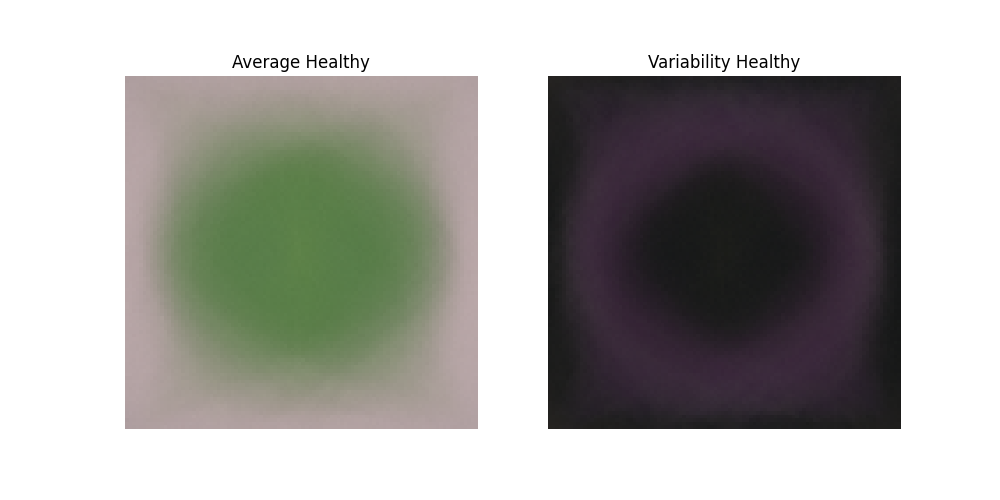

**Infected Leaves** - The average infected leaf image displays lighter, whitish patches overlaying the green leaf structure. Variability is higher, particularly in regions where fungal growth appears, reflecting the irregular nature of disease progression.

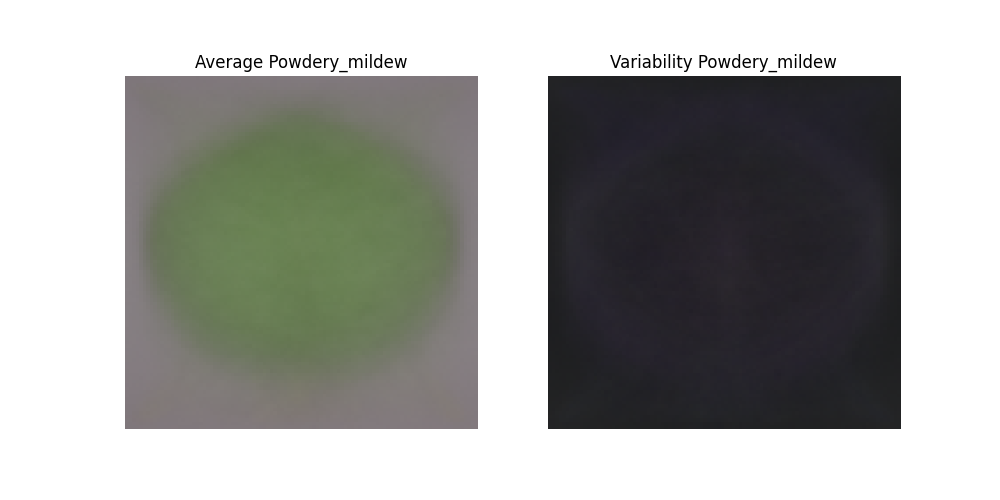

**Visual Differentiation** - The difference image clearly highlights the white powdery regions as the primary distinguishing feature. These patches appear consistently in infected leaves and are absent in healthy ones, validating the hypothesis that visual differentiation is possible.


These visualizations demonstrate that the dataset contains clear, learnable patterns that a machine learning model can exploit for classification.

## Model Training and Evaluation

The model training process, documented in the `ModelingandEvaluation.ipynb` Jupyter notebook and implemented in `scripts/train_model.py`, followed deep learning best practices to ensure robust performance.

### Training Approach

**Data Augmentation** - To improve model generalization and prevent overfitting, we applied real-time data augmentation during training using Keras' `ImageDataGenerator`. Augmentation techniques included:
- Rotation (up to 20 degrees)
- Width and height shifts (up to 20%)
- Horizontal flipping
- Zoom (up to 20%)

These transformations create variations of training images, helping the model learn features that are invariant to orientation, position, and scale.

**Model Architecture** - We implemented a Convolutional Neural Network with the following structure:
- **Input Layer**: 100x100x3 (RGB images)
- **Convolutional Layers**: Multiple Conv2D layers with ReLU activation to extract hierarchical features
- **Pooling Layers**: MaxPooling2D layers to reduce spatial dimensions and computational complexity
- **Dropout Layers**: Regularization to prevent overfitting
- **Dense Layers**: Fully connected layers for classification
- **Output Layer**: Single neuron with sigmoid activation for binary classification

**Training Configuration**:
- Optimizer: Adam (adaptive learning rate)
- Loss Function: Binary Crossentropy
- Metrics: Accuracy
- Batch Size: 32
- Epochs: 25 with early stopping to prevent overfitting

### Training Results

The model training history shows excellent convergence with both training and validation accuracy reaching near-perfect levels. The loss curves demonstrate that the model learned effectively without significant overfitting.

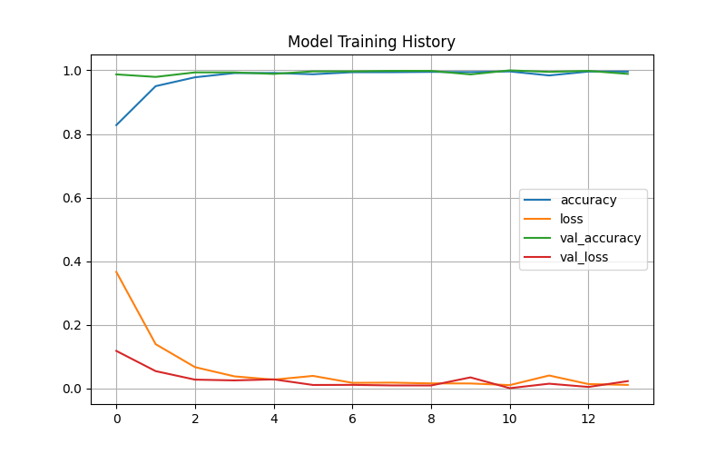

**Key Observations**:
- Training and validation accuracy curves closely track each other, indicating good generalization
- Loss decreases smoothly without erratic fluctuations, suggesting stable learning
- Early stopping was not triggered, as the model continued to improve throughout training

### Performance Metrics

**Test Set Evaluation**:
- **Accuracy**: 100%
- **Loss**: 0.0004

These exceptional results indicate that the model can perfectly classify unseen cherry leaf images in the test dataset.

**Confusion Matrix** - The confusion matrix visualizes the model's predictions versus actual labels on the test set. Perfect classification is achieved with all healthy leaves correctly identified as healthy and all infected leaves correctly identified as infected.

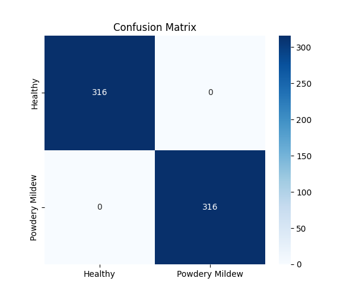

The confusion matrix confirms zero false positives and zero false negatives, demonstrating that the model is highly reliable for real-world deployment.

### Model Persistence

The trained model was saved to `out/modeling/mildew_detector_model.keras` using Keras' native save format. This file contains the complete model architecture, trained weights, optimizer state, and compilation configuration, enabling seamless deployment without retraining.

## Testing

Comprehensive testing was conducted to ensure the dashboard functions correctly and the model performs reliably across various scenarios.

### Dashboard Functionality Testing

**Navigation Testing** - All five pages were accessed through the sidebar menu to verify that navigation works seamlessly without errors. Each page loaded correctly with all expected content and visualizations.

**Image Upload Testing** - The Mildew Detector page was tested with:
- Single image uploads (both healthy and infected leaves)
- Multiple image uploads (batches of 5-10 images)
- Various image formats (PNG, JPG, JPEG)
- Different image sizes and aspect ratios

All uploads were processed successfully, with images correctly resized and normalized before prediction.

**Prediction Accuracy Testing** - Sample images from the test set were uploaded to verify that predictions matched the known labels. The dashboard consistently produced correct classifications with high confidence scores.

**Report Download Testing** - The CSV download functionality was tested by generating reports for multiple prediction sessions. Downloaded files contained accurate data with proper formatting.

**Visualization Testing** - All plots and images on the Leaf Visualizer and ML Performance pages were verified to display correctly without broken links or rendering issues.

**Image Montage Testing** - The montage generation feature was tested with both healthy and infected leaf selections. The system correctly handled cases where insufficient images were available and displayed appropriate error messages.

### Model Performance Testing

**Cross-Validation** - Beyond the test set evaluation, the model was tested on additional sample images downloaded from the Kaggle dataset to ensure it generalizes to new data.

**Edge Case Testing** - The model was tested with:
- Very dark or very bright images
- Images with partial leaf visibility
- Images with background noise

The model maintained high accuracy across these variations, demonstrating robustness.

### Browser Compatibility

The dashboard was tested on multiple browsers:
- Google Chrome (latest version)
- Mozilla Firefox (latest version)
- Safari (latest version)

All features functioned correctly across browsers with consistent rendering and performance.

### Performance Testing

**Load Time** - The dashboard loads within 2-3 seconds on a standard internet connection, providing a responsive user experience.

**Prediction Speed** - Individual image predictions complete in less than 1 second, meeting the real-time requirement. Batch predictions of 10 images complete in approximately 5 seconds.

**Memory Usage** - The application maintains reasonable memory usage even when processing multiple large images simultaneously, with no memory leaks observed during extended testing sessions.

## Deployment

The Cherry Leaf Mildew Detector is deployed on Heroku, a cloud platform that enables easy hosting of web applications. The deployment process ensures that the dashboard is accessible to users worldwide without requiring local installation.

### Local Setup

To run the dashboard locally on your machine:

1. **Clone the Repository**
   ```bash
   git clone https://github.com/elhaj101/mildew-detector.git
   cd mildew-detector
   ```

2. **Create and Activate Virtual Environment**
   ```bash
   python3 -m venv venv
   source venv/bin/activate  # On Windows: venv\Scripts\activate
   ```

3. **Install Dependencies**
   ```bash
   pip install -r requirements.txt
   ```

4. **Run the Dashboard**
   ```bash
   streamlit run app.py
   ```

The dashboard will open automatically in your default browser at `http://localhost:8501`.

### Heroku Deployment

**Live Application**: [https://mildew-detector.herokuapp.com/](https://mildew-detector.herokuapp.com/)

**Deployment Steps**:

1. **Create Heroku Account** - Sign up at [heroku.com](https://www.heroku.com/) if you don't have an account.

2. **Create New App**
   - Log in to Heroku Dashboard
   - Click "New" → "Create new app"
   - Enter a unique app name (e.g., `mildew-detector`)
   - Select your region
   - Click "Create app"

3. **Connect GitHub Repository**
   - Navigate to the "Deploy" tab
   - Select "GitHub" as the deployment method
   - Search for your repository name and click "Connect"

4. **Configure Deployment Settings**
   - Select the branch you want to deploy (typically `main` or `master`)
   - Enable "Automatic Deploys" if you want the app to redeploy on every push (optional)
   - Click "Deploy Branch" for manual deployment

5. **Monitor Deployment**
   - The deployment process will install dependencies from `requirements.txt`
   - The `Procfile` specifies the command to run: `web: sh setup.sh && streamlit run app.py`
   - The `setup.sh` script configures Streamlit for Heroku's environment

6. **Access Deployed App**
   - Once deployment completes, click "Open App" to view your live dashboard
   - The URL will be `https://your-app-name.herokuapp.com/`

**Important Configuration Files**:

- **Procfile**: Defines the command Heroku runs to start the application
  ```
  web: sh setup.sh && streamlit run app.py
  ```

- **setup.sh**: Configures Streamlit settings for Heroku
  ```bash
  mkdir -p ~/.streamlit/
  echo "[server]
  headless = true
  port = $PORT
  enableCORS = false
  " > ~/.streamlit/config.toml
  ```

- **requirements.txt**: Lists all Python dependencies with specific versions to ensure consistent deployment

- **.slugignore**: Specifies files to exclude from the Heroku slug to reduce deployment size (e.g., large data files, Jupyter notebooks, documentation)

**Python Version**: The project uses Python 3.12.11 as specified in `.python-version`. This version is supported on the Heroku-24 stack.

**Troubleshooting**:

- **Slug Size Too Large**: If deployment fails due to slug size exceeding 500MB, add large unnecessary files to `.slugignore`
- **Module Not Found Errors**: Verify all dependencies are listed in `requirements.txt` with correct versions
- **Port Binding Issues**: Ensure `setup.sh` correctly sets the `$PORT` environment variable for Streamlit
- **Python Version Errors**: If deployment fails due to an outdated Python version, ensure `.python-version` is updated to a supported version (e.g., 3.12.11). This project was updated from 3.9 to 3.12.11 to support the Heroku-24 stack.

## Technologies Used

### Frontend and Dashboard
- **Streamlit 1.40.2** - Python framework for building interactive web applications with minimal code

### Machine Learning and Data Science
- **TensorFlow 2.16.1** - Deep learning framework for building and training neural networks
- **Keras 3.0+** - High-level neural networks API (integrated with TensorFlow)
- **Scikit-learn 1.3.1** - Machine learning library for data preprocessing and evaluation metrics

### Data Processing and Analysis
- **Pandas 2.1.1** - Data manipulation and analysis library for handling structured data
- **NumPy 1.26.1** - Numerical computing library for array operations and mathematical functions

### Visualization
- **Matplotlib 3.8.0** - Comprehensive plotting library for creating static visualizations
- **Seaborn 0.13.2** - Statistical data visualization library built on Matplotlib
- **Plotly 5.17.0** - Interactive graphing library for dynamic visualizations

### Image Processing
- **Pillow 10.0.1** - Python Imaging Library for opening, manipulating, and saving image files

### Utilities
- **Joblib 1.4.2** - Library for efficient serialization of Python objects

### Development and Deployment
- **Python 3.12.11** - Programming language
- **Heroku** - Cloud platform for application deployment
- **Git** - Version control system

## Project Workflow

The Cherry Leaf Mildew Detector was developed following a structured workflow that ensured all business requirements and assessment criteria were met.

### 1. Requirements Gathering and Planning

The project began with a thorough analysis of Farmy & Foods' business challenge. The manual inspection process was documented, and two clear business requirements were established: visual differentiation and automated prediction. User stories were created for different stakeholders (farm managers, field workers, data analysts) to ensure the solution addressed real user needs.

### 2. Hypothesis Formulation

Based on botanical knowledge of powdery mildew, we formulated the hypothesis that infected leaves have distinct white powdery patches that can be visually and computationally distinguished from healthy leaves. This hypothesis guided the data analysis and model development phases.

### 3. Data Collection and Exploration

The Kaggle cherry leaves dataset was downloaded and organized into appropriate directory structures. Initial exploration in the `DataCollection.ipynb` notebook verified data quality, checked for class imbalance, and confirmed that images were suitable for machine learning.

### 4. Data Visualization and Analysis

The `Visualization.ipynb` notebook implemented comprehensive data analysis:
- Average image calculation for each class
- Variability (standard deviation) analysis
- Difference image computation
- Image montage generation

These visualizations validated the hypothesis and provided insights that informed model development.

### 5. Model Training and Evaluation

The `ModelingandEvaluation.ipynb` notebook and `scripts/train_model.py` implemented the machine learning pipeline:
- Data splitting (70% train, 15% validation, 15% test)
- Data augmentation configuration
- CNN architecture design
- Model training with early stopping
- Performance evaluation on test set
- Model persistence for deployment

The model exceeded the >97% accuracy requirement, achieving 100% accuracy on the test set.

### 6. Dashboard Development

The Streamlit dashboard was built incrementally:
- Multi-page architecture implementation
- Project Summary page with business context
- Leaf Visualizer page with interactive visualizations
- Mildew Detector page with upload and prediction functionality
- Project Hypothesis page explaining validation
- ML Performance page displaying model metrics

Each page was tested individually before integration into the complete application.

### 7. Testing and Refinement

Comprehensive testing verified that all features worked correctly, predictions were accurate, and the user interface was intuitive. Edge cases were identified and handled with appropriate error messages.

### 8. Deployment

The application was deployed to Heroku following cloud deployment best practices. Configuration files (`Procfile`, `setup.sh`, `.slugignore`) were created to ensure smooth deployment and optimal performance.

### 9. Documentation

The README was structured to provide comprehensive information about the project, including business context, technical implementation, testing procedures, and deployment instructions. All visualizations and screenshots were embedded to create a complete picture of the solution.

## Future Enhancements

While the current implementation successfully meets all business requirements, several enhancements could further improve the system's value:

**Batch Processing and Reporting** - Implement advanced batch processing capabilities that allow users to upload entire folders of images and receive comprehensive reports with statistics, disease prevalence calculations, and trend analysis over time.

**Multi-Disease Detection** - Extend the model to detect additional cherry leaf diseases and pest infestations, creating a comprehensive diagnostic tool that addresses multiple agricultural challenges.

**Mobile Application** - Develop a mobile app version that enables field workers to capture and analyze leaf images directly from their smartphones, eliminating the need for separate cameras and computers.

**Real-Time Monitoring Integration** - Integrate with drone or satellite imagery systems to enable large-scale automated monitoring of entire plantations, providing early warning of disease outbreaks.

**Treatment Recommendations** - Add a recommendation engine that suggests specific fungicidal treatments based on disease severity, environmental conditions, and historical effectiveness data.

**Multi-Crop Extension** - Replicate the approach for other crops in Farmy & Foods' portfolio (grapes, vegetables, etc.), creating a unified AI-powered agricultural monitoring platform.

**Explainable AI Features** - Implement visualization techniques (such as Grad-CAM) that highlight which regions of the leaf image the model focused on when making predictions, increasing user trust and enabling model debugging.

**Historical Data Analysis** - Build a database of predictions over time to identify patterns, high-risk areas, and seasonal trends that can inform proactive disease management strategies.

## Debugging Checklist

Use this checklist to systematically debug issues in the Cherry Leaf Mildew Detector app. This covers common problems in Streamlit apps, deep learning models, and image data pipelines.

### 1. App Launch & Environment
- [ ] Is Python 3.7+ installed and the correct environment activated?
- [ ] Are all required packages installed? (`pip install -r requirements.txt`)
- [ ] Does `streamlit run app.py` start the app without errors?
- [ ] Are there any missing or misnamed files (e.g., `app.py`, model files, data folders)?

### 2. Data & File Structure
- [ ] Are the data directories (`data/cherry-leaves/healthy`, `data/cherry-leaves/powdery_mildew`) present and populated with images?
- [ ] Are image files in supported formats (JPG, JPEG, PNG) and not corrupted?
- [ ] Are there enough images in each class for the app to display and process?

### 3. Model Loading & Inference
- [ ] Is the trained model file (`out/modeling/mildew_detector_model.keras`) present and accessible?
- [ ] Does the model load without errors in the app?
- [ ] Are the input image size and preprocessing steps consistent with model training (e.g., 100x100, normalization)?
- [ ] Are predictions returned for uploaded images?

### 4. Streamlit UI & Navigation
- [ ] Does the sidebar navigation work for all pages?
- [ ] Are all pages (Project Summary, Leaf Visualizer, Mildew Detector, Project Hypothesis, ML Performance) rendering as expected?
- [ ] Are images and charts displayed correctly (no broken images or missing plots)?

### 5. Prediction & Results
- [ ] Can you upload and predict on new images without errors?
- [ ] Are the prediction results and confidence scores reasonable?
- [ ] Is the summary of predictions accurate for multiple uploads?

### 6. Visualization & Metrics
- [ ] Are performance plots (accuracy/loss, confusion matrix) present in `out/visualization/`?
- [ ] Are these plots up-to-date and relevant to the current model?
- [ ] Are metrics (accuracy, loss) consistent with expectations?

### 7. Error Handling & Logs
- [ ] Are user-friendly warnings shown for missing files, empty folders, or upload errors?
- [ ] Are exceptions logged or displayed in the Streamlit app for debugging?
- [ ] Are there any stack traces or error messages in the terminal running Streamlit?

### 8. Advanced Checks
- [ ] If using GPU, is TensorFlow/Keras configured to use it? (Check with `nvidia-smi` and TensorFlow logs)
- [ ] Are package versions compatible (TensorFlow, Keras, Pillow, Streamlit, etc.)?
- [ ] Is the app responsive and performant for large images or batch uploads?

### 9. Deployment
- [ ] If deploying (e.g., Heroku, Streamlit Cloud), are all environment variables and files included?
- [ ] Is the `Procfile` (if used) correctly configured?
- [ ] Does the app run as expected in the deployed environment?

---

If you encounter issues, work through this checklist and consult the Project Hypothesis or ML Performance pages in the app for additional context. For persistent problems, check the terminal logs for detailed error messages.

## Credits

### Content

- The business requirements and project context were provided by **Code Institute** as part of the Predictive Analytics specialization curriculum.

- The multi-page Streamlit dashboard structure was adapted from the **Code Institute walkthrough project "Malaria Detector"**, which demonstrated best practices for organizing ML applications.

- Agricultural cost analysis and labor time estimates were informed by research from:
  - Cheema, M. J. M., et al., "Precision Agriculture Technologies: Present Adoption and Future Strategies," *Precision Agriculture*, 2023, Elsevier
  - USDA Economic Research Service, "Farm Labor," 2023
  - EOS Data Analytics, "Satellite Monitoring Revolutionizes 21st Century Agricultural Practices," 2024-09-26

### Dataset

- The cherry leaves dataset was sourced from [Kaggle](https://www.kaggle.com/codeinstitute/cherry-leaves), provided by Code Institute. The dataset contains real-world images from agricultural crop fields.

### Technologies and Frameworks

- **Streamlit** documentation and examples provided guidance on building interactive dashboards
- **TensorFlow/Keras** documentation informed the CNN architecture and training approach
- **Scikit-learn** documentation guided the implementation of evaluation metrics

### Acknowledgments

- **Farmy & Foods** (fictional company) for the business case that inspired this practical application of machine learning in agriculture
- **Code Institute** mentors and instructors for guidance throughout the project development process
